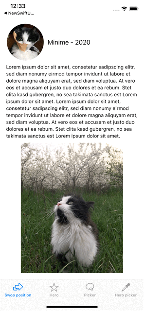
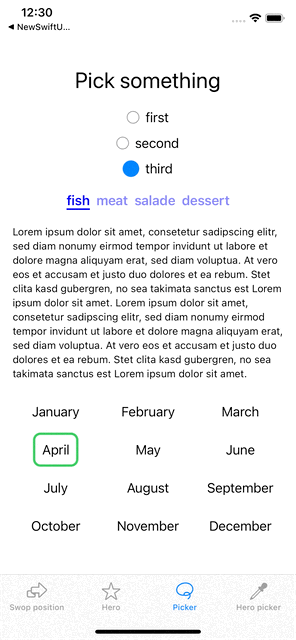
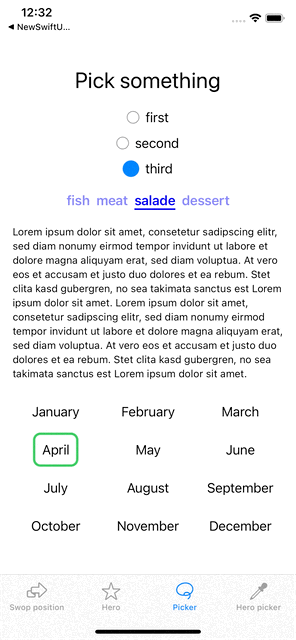

# Examples for MatchedGeometryEffect

This demo project demonstrates different use cases for matched geometry effect in SwiftUI.

matchedGeometryEffect(id:in:properties:anchor :isSource:)

**Important:**
- only use one view with isSource is true (for the same id)
- does not work with NavigationView (transition to detail) or sheets, popover etc.

## Youtube tutorials
This is the sample project that I develope during a mini-series on Youtube. You can learn how to write this code at:
- Part 1 The basics  https://youtu.be/oy30a4zTdCs
- Part 2 Hero animations https://youtu.be/EkjY0TLDLas
- Part 3 Animating Pickers https://youtu.be/sqrW8RGtn40

# animation of layout changes
example: switch between HStack and VStack depending on device orientation
in AdaptiveCatView

   

## Hero animation
in CatCollectionView

   
   

## Pickers with one selected element 

   
   
   
   
Files:
  - left example: in CirclePicker
  - middle example: in SliderPicker
  - right example: in  CalenderView, original from SwiftUI-lab https://swiftui-lab.com/matchedgeometryeffect-part2/
 
 
## Pickers with multiple selected elements
in EmojiPicker: multiple items selected with Hero Animation

   
  
  
  
  
