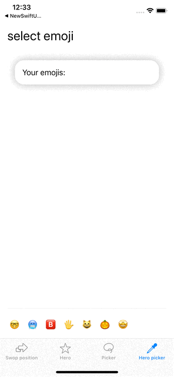

# Examples for MatchedGeometryEffect

This demo project demonstrates different use cases for matched geometry effect in SwiftUI.

matchedGeometryEffect(id:in:properties:anchor:isSource:)

Important:
- only use one view with isSource is true (for the same id)
- does not work with NavigationView transition to Detail or sheets, popover etc.

# animation of layout changes
example: switch between HStack and VStack depending on device orientation
in AdaptiveCatView

   

## Hero animation
in CatCollectionView

   
   

## Pickers with one selected element 

   
   
   
   
Files:
  - left example: in CirclePicker
  - middle example: in SliderPicker
  - right example: in  CalenderView, original from SwiftUI-lab https://swiftui-lab.com/matchedgeometryeffect-part2/
 
 
## Pickers with multiple selected elements
in EmojiPicker: multiple items selected with Hero Animation

   
  
  
  
  
